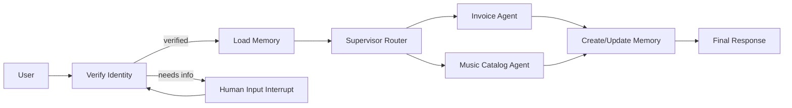

# 🎵 Multi-Agent Customer Support Demo (LangGraph + Gradio)

An AI-powered **multi-agent customer support** system for a digital music store.  
Built with **LangGraph** for orchestration, **LangChain** for LLM tooling, and **Gradio** for the web UI.

✅ Live demo (Hugging Face Space): https://huggingface.co/spaces/animeshkcm/Multi-Agent-AI-System

---

## Table of Contents

- [What this project does](#what-this-project-does)
- [Key features](#key-features)
- [Architecture overview](#architecture-overview)
- [How identity verification works](#how-identity-verification-works)
- [Agents and tools](#agents-and-tools)
- [Long-term memory](#long-term-memory)
- [Repository structure](#repository-structure)
- [Sample prompts](#sample-prompts)
- [Run locally](#run-locally)
- [Configuration (environment variables)](#configuration-environment-variables)
- [Deploy to Hugging Face Spaces (in depth)](#deploy-to-hugging-face-spaces-in-depth)
- [How the Gradio UI works](#how-the-gradio-ui-works)
- [Troubleshooting](#troubleshooting)
- [Security notes](#security-notes)
- [Credits](#credits)
- [License](#license)

---

## What this project does

This demo simulates a production-style customer support assistant for a music store backed by the **Chinook SQLite** sample database.

Users can:
- Verify identity using **Customer ID**, **Email**, or **Phone number**
- Ask about **invoices / purchases / billing details** (Invoice Agent)
- Ask about **artists / albums / tracks / genres** (Music Catalog Agent)
- Have music preferences remembered during the session (Long-term memory)

The intent is to showcase a real multi-agent workflow:

**Verify → Load memory → Supervisor routes → Tools run → Save memory → Respond**

---

## Key features

### 1) Customer identity verification (human-in-the-loop)
Before invoice or customer-specific data is returned, the system confirms identity using one of:
- Customer ID (numeric)
- Email
- Phone number

If the user is not verified yet, the system asks for one of these identifiers politely.

### 2) Supervisor-based routing
A supervisor agent decides which specialized sub-agent should handle the request:
- **Invoice Information Sub-Agent**: invoices, purchases, billing
- **Music Catalog Sub-Agent**: songs, albums, artists, genres

For mixed questions, the routing rule is:
1) invoice portion first  
2) music portion second

### 3) Tool-using agents (SQL-backed)
Agents use tools that run SQL against the Chinook database to return grounded results.

### 4) Long-term memory (preferences)
When the user explicitly says they like something (for example: “I love rock music” or “I like AC/DC”),
the system stores that preference and can use it later for personalization.

---

## Architecture overview

### High-level flow

```
User Query
  → Verify Identity (LLM structured extraction + DB lookup)
  → Load Memory (if customer_id exists)
  → Supervisor Router
      → [Invoice Agent] or [Music Agent]
  → Create/Update Memory
  → Response
```

### Mermaid diagram



### Core components (mapped to files)

- `app.py`: UI + session state + graph invocation
- `graph_builder.py`: compiles the LangGraph workflow
- `nodes.py`: verification node, interrupt node, memory nodes, music assistant node
- `tools.py`: SQL tools for both agents
- `database.py`: downloads and loads Chinook into an in-memory SQLite engine
- `prompts.py`: system prompts for verification, supervisor, invoice agent, memory prompt
- `models.py`: Pydantic schemas for structured extraction and memory
- `state.py`: shared LangGraph state schema

---

## How identity verification works

Identity verification happens inside `nodes.py` using two steps:

### Step 1: Structured extraction (LLM)
A structured output model (`UserInput`) extracts a single field:

- `identifier`: customer ID, email, or phone

This is guided by `STRUCTURED_EXTRACTION_PROMPT` in `prompts.py`.

### Step 2: Database lookup (SQL)
The identifier is matched against the Chinook `Customer` table:

- If numeric → checks `CustomerId`
- If email → checks `Email`
- If phone → checks `Phone`

If a match is found:
- The graph sets `state.customer_id`
- A system message is injected stating the verified customer ID so downstream agents can use it reliably

If not found:
- The user is asked to double check and try again

---

## Agents and tools

### Music Catalog Agent
Used for music discovery: artists, albums, tracks, genres.

Tools (from `tools.py`):
- `get_albums_by_artist(artist)`
- `get_tracks_by_artist(artist)` (returns up to 20)
- `get_songs_by_genre(genre)` (returns a small representative list)
- `check_for_songs(song_title)` (returns up to 10 matches)

This agent is implemented as a small ReAct-style loop using:
- a custom assistant node that can call tools
- a `ToolNode` that executes tool calls
- conditional edge `should_continue` that loops until no tool call is needed

### Invoice Information Agent
Used for billing and purchase history.

Tools:
- `get_invoices_by_customer_sorted_by_date(customer_id)` (most recent first)
- `get_invoices_sorted_by_unit_price(customer_id)`
- `get_employee_by_invoice_and_customer(invoice_id, customer_id)` (support rep info)

This agent is created via LangGraph prebuilt `create_react_agent` and is prompted with `INVOICE_SUBAGENT_PROMPT`.

### Supervisor router
The supervisor decides whether to call:
- invoice agent
- music agent

Routing rules are in `SUPERVISOR_PROMPT`:
- Music questions → music agent
- Invoice questions → invoice agent
- Mixed questions → invoice first, then music

---

## Long-term memory

This demo includes a simple memory profile for each verified customer.

### What is stored?
A `UserProfile` object:

- `customer_id`
- `music_preferences`: list of preferences (artist names, genres, etc.)

### Rules for storing memory
Memory is updated only when the user **explicitly** states a preference.
Examples that should be stored:
- “I love rock music”
- “I like AC/DC”
- “Jazz is my favorite”

Examples that should not be stored:
- “Do you have rock music?”
- “What songs are in Jazz?”

### How memory is loaded and saved
- `load_memory` pulls the profile from the in-memory store into `loaded_memory`
- `create_memory` uses `CREATE_MEMORY_PROMPT` to update the memory profile and saves it back

Note: The current implementation uses `InMemoryStore`, so memory resets when the Space restarts.
If you want persistent memory, replace the store with a persistent backend (Redis, Postgres, etc.).

---

## Repository structure

```
.
├── app.py
├── database.py
├── graph_builder.py
├── models.py
├── nodes.py
├── prompts.py
├── requirements.txt
├── state.py
├── tools.py
└── README.md
```

---

## Sample prompts

Try these in the UI:

- “My customer ID is 1. What was my most recent purchase?”
- “My phone number is +55 (12) 3923-5555. How much was my most recent invoice?”
- “What albums do you have by the Rolling Stones?”
- “Do you have any songs by AC/DC? I love rock music!”
- “My email is luisg@embraer.com.br. Who helped me with my latest invoice?”
- “What songs do you have in the Jazz genre?”
- “My customer ID is 3. What is my most recent purchase? Also, what albums do you have by U2?”

---

## Run locally

### 1) Clone the repo
```bash
git clone <YOUR_GITHUB_REPO_URL>
cd <YOUR_REPO_FOLDER>
```

### 2) Create and activate a virtual environment
```bash
python -m venv .venv
source .venv/bin/activate     # Mac/Linux
# .venv\Scripts\activate    # Windows
```

### 3) Install dependencies
```bash
pip install -r requirements.txt
```

### 4) Set environment variables
```bash
export OPENAI_API_KEY="your_openai_key"
export MODEL_NAME="gpt-4o-mini"
# optional:
export OPENAI_API_BASE=""
```

### 5) Run
```bash
python app.py
```

Then open:
- http://localhost:7860

---

## Configuration (environment variables)

| Variable | Required | Default | Description |
|---------|----------|---------|-------------|
| `OPENAI_API_KEY` | Yes | none | OpenAI API key |
| `MODEL_NAME` | No | `gpt-4o-mini` | Model name used by ChatOpenAI |
| `OPENAI_API_BASE` | No | empty | Optional custom base URL for compatible providers |

---

## Deploy to Hugging Face Spaces (in depth)

This project is already structured correctly for Hugging Face Spaces using the **Gradio SDK**.

### A) Prerequisites (must have)
Your Space repo should contain:
- `app.py` at the repo root
- `requirements.txt` at the repo root
- `README.md` with the YAML header:

```yaml
sdk: gradio
app_file: app.py
```

### B) Create a Space
1. Go to Hugging Face
2. Click **New Space**
3. Fill:
   - **Owner**: your account
   - **Space name**: choose a name
   - **SDK**: Gradio
   - **Visibility**: Public or Private
4. Click **Create Space**

### C) Upload/push the code
You can do this in two ways:

#### Option 1: Web upload
- Open your Space repo
- Upload all project files (all `.py`, `requirements.txt`, `README.md`)

#### Option 2: Git push (recommended)
1. Clone Space repo:
   ```bash
   git clone https://huggingface.co/spaces/<USERNAME>/<SPACE_NAME>
   cd <SPACE_NAME>
   ```
2. Copy project files into this folder
3. Commit and push:
   ```bash
   git add .
   git commit -m "Deploy multi-agent customer support demo"
   git push
   ```

After pushing, the Space will automatically start building.

### D) Add secrets (this is required)
Your app will not initialize unless `OPENAI_API_KEY` is set.

1. Open your Space page
2. Go to **Settings**
3. Scroll to **Variables and secrets**
4. Add **Repository secrets**:
   - `OPENAI_API_KEY` = your key
5. Optional secrets/variables:
   - `MODEL_NAME` = `gpt-4o-mini`
   - `OPENAI_API_BASE` = custom base url (only if you need it)

Important:
- Use **Secrets** for private keys.
- Do not hardcode keys inside code files.

### E) Verify build logs
Go to the Space → **Logs** and confirm:
- Database initialized OK
- Agent graph built OK

If you see “OPENAI_API_KEY is not set”:
- The secret was not added correctly
- Or it was added as a Variable instead of Secret
- Or the key name is incorrect

### F) Confirm the app works
Once the build completes:
- Open the Space
- Try an example prompt
- Verify that verification flow works
- Verify that invoice/music queries route correctly

### G) About Space restarts and memory
This demo uses an in-memory store.
If the Space restarts, memory resets.

To make memory persistent, you would need:
- persistent storage or a database
- replace `InMemoryStore` with a persistent store

---

## How the Gradio UI works

The UI is built using Gradio Blocks in `app.py`.

Key UI design behavior:
- The user message appears instantly in chat (without waiting for the model)
- Then the agent runs and the assistant response is appended

This is implemented with a **two-step event chain**:

1) `add_user_message()`  
   - appends user message to chat history immediately  
   - clears the input field

2) `run_agent()`  
   - invokes LangGraph using the last user message  
   - updates session state  
   - updates the status strip  
   - appends assistant response to chat

There is also a “New Chat” button that resets the conversation state.

---

## Troubleshooting

### 1) OPENAI_API_KEY is not set
Cause:
- Secret not added in Space settings

Fix:
- Space → Settings → Variables and secrets → add Repository secret `OPENAI_API_KEY`

### 2) Space builds but UI shows init error
Cause:
- Database download failed, or graph build failed

Fix:
- Check Space logs
- Rebuild Space
- Ensure network access to GitHub raw is available

### 3) langgraph_supervisor import error
Cause:
- missing dependency

Fix:
- Ensure `langgraph-supervisor>=0.0.20` exists in `requirements.txt`
- Rebuild Space

### 4) Requests timeout on database download
Cause:
- temporary network issue or rate limiting

Fix:
- Rebuild Space later
- For production, vendor the SQL file inside the repo and load locally

### 5) Slow first response
Cause:
- cold start + database initialization + model cold start

Fix:
- normal for first run; subsequent runs are faster

---

## Security notes

This is a demo. For a real production app, you should address:

### 1) SQL injection protection
Some SQL queries are built using f-strings.  
In production:
- use parameterized queries
- sanitize inputs
- limit wildcard search patterns

### 2) Rate limiting and abuse protection
For public demos:
- add request throttling
- add usage limits per session/user

### 3) Sensitive info
Never log secrets or store them in the repo.
Use Space secrets or environment variables only.

---

## Credits

- **LangGraph** and **LangChain** for multi-agent orchestration and tool calling
- **Gradio** for the web UI
- **Chinook Database** for the sample music store dataset

---

## License

MIT License (see `LICENSE`).
